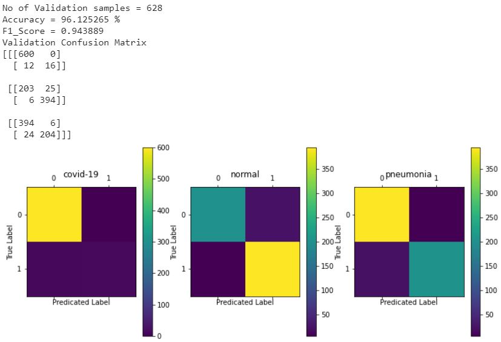

# msds18052_COVID19_DLSpring2020
This repository contains code and results for COVID-19 classification assignment by Deep Learning Spring 2020 course offered at Information Technology University, Lahore, Pakistan. This assignment is only for learning purposes and is not intended to be used for clinical purposes.

# Part 2 (BCEWithLogits Loss and Focal Loss)
## Dataset
Dataset is available at the following path.
https://drive.google.com/file/d/1eytbwaLQBv12psV8I-aMkIli9N3bf8nO/view

## Weights
Weights for all the experiments performed are available at following location:
https://drive.google.com/drive/folders/1X5blPHW-Vgz_IOYCfwyRBeNgoyd-w4s_?usp=sharing

## Experiment 1 (VGG-16) with BCE with Logits Loss:
### Accuracy and Loss Curves

### Training Confusion Matrix, Accuracy and F1-Score

### Validation Confusion Matrix, Accuracy and F1-Score

## Experiment 2 (VGG-16) with Focal Loss (Gamma = 2) - Model with best accuracy of COVID-19 class:
### Accuracy and Loss Curves

### Training Confusion Matrix, Accuracy and F1-Score

### Validation Confusion Matrix, Accuracy and F1-Score

## Experiment 3 (RES-18) with BCE with Logits Loss:
### Accuracy and Loss Curves

### Training Confusion Matrix, Accuracy and F1-Score

### Validation Confusion Matrix, Accuracy and F1-Score

## Experiment 4 (RES-18) with Focal Loss (Gamma = 2):
### Accuracy and Loss Curves

### Training Confusion Matrix, Accuracy and F1-Score

### Validation Confusion Matrix, Accuracy and F1-Score

# Part 1 (Binary Cross Entropy Loss)
## Dataset
Dataset is available at the following path.
https://drive.google.com/drive/u/1/folders/1-FzZhQO9oHIT9SNOWYoKsuz7fe447vtR

## Results:
Following are the Confusion Matrix and Accuracy for best model.
### Confusion Matrix
#### Training

#### Testing

#### Validation

### Accuracy
Training: 95%
 
Testing: 96%
 
Validation: 90%
